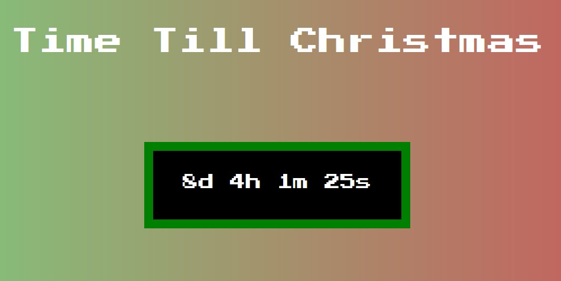

<!-- ## Christmas is coming, but when will santa arrive?

I was always facinated by [Norad's santa tracker](https://www.noradsanta.org/). That is why this year I felt obligated to try and develop my own. 

## First
I built a basic webpage that display how much longer till christmas is here. Obviously, it didnt accept any user interaction so the basic <Date().getTime();> javascript function only provided me with the basic UTC time stored from your local browser. Let's do better.

## Second
Since all 7.85 Billion humans do not live in the same timezone as myself, I have to provide a function which allows for users to select their timezone. Then I can calculate the time till Christmas from there.  -->